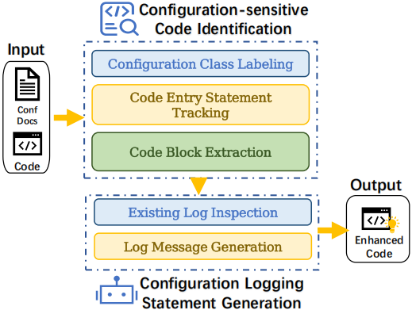

## Introduction
This is the code repository of ConfLogger proposed in the paper [ConfLogger: Enhance Systems' Configuration Diagnosability through Configuration Logging](https://arxiv.org/abs/2508.20977)

## requirements
1. jdk version == 11.0
2. python version >= 3.9

## quick start 
Step 1. `git clone https://github.com/shanshw/ConfLogger.git`

Step 2. `cd ConfLogger`

Step 3. `mvn clean compile`
### activate the static taint analysis 
To start the static taint analysis, one needs to specifiy four parameters:
- `-jar`: paht of jar file of the target system
- `-cd`: configuration documentation of the target system
- `-scope` and `-exclusion`: A scope file and an exclusion file to configure [WALA Framework](https://github.com/wala/WALA).

    The **scope file** includes the path of the jar files and the path of the source code directory.
    
    The **execlusion file** includes classes that would not be analyzed during the static taint analysis.

    To take a detailed investigation into these files, please refer to [WALA Docs](https://github.com/wala/WALA/wiki/Analysis-Scope).

We recommend the following cmd the activate the procedure:

    mvn exec:java -Dexec.args="-jar /xxx/xxx/xxx.jar -cd xxx/xxx/xxx.xml -scope xxx/xxx/xx/scope.txt -exclusion xxx/xxx/xx/exclusion.txt"

Here is an example cmd on HCommon project. 

    mvn exec:java -Dexec.args="
    -jar src/main/resources/jars/hadoop-common-3.3.6.jar 
    -cd src/main/resources/confs/hadoop/core-default.xml 
    -scope src/main/resources/scope.txt 
    -exclusion src/main/resources/exclusion.txt"

The results of the procedure is a bunch of files stored in the `paResults` directory. 
These files will be named as `Method-Wise-CCH_<xxx>.out`, where `<xxx>` indicates placeholders.

### activate the logging statement generation
To activate the logging statement generation phase, please ensure the CCH blocks are captured during the program analysis.

The core functionality is achieved in [llm_interaction](src/PYTHON/llm_interatction.py) file. 
We call the python file through `genLog` function in the [Main](src/JAVA/main/java/org/example/Main.java) file. 
We employ gpt-4o to achieve the goal of logging statement generation, *plase specify the api key first in [llm_interaction](PythonCode/llm_interatction.py) file*. 

Specified the OPENAI Key, please overwrite the `main` function and directly call to the `genLog` function with the directory holding the `Method-Wise-CCH_<xxx>.out` files as parameter.
